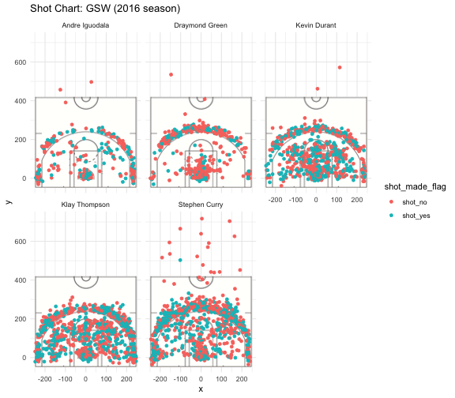

```{r setup, include=FALSE}
knitr::opts_chunk$set(echo = TRUE)
```

```{r out.width = '80%', echo=FALSE, fig.align='center'}

```

```{r}
library(ggplot2)
install.packages("jpeg")
library(jpeg)
library(dplyr)
library(grid)
court_file <- "../images/nba-court.jpg"
court_image <- rosterGrab(readJPEG(court_file), width = unit(1,"npc"), height = unit(1,"npc"))
```

```{r}
data_types = c("team_name"="character", "game_date"="character", "season" = "integer", "period"="integer",
               "minutes_remaining"="integer", "seconds_remaining"="integer", "shot_made_flag"="character",
               "action_type"="factor", "shot_type"="factor", "shot_distance"="integer", "opponent"="character",
               "x"="integer", "y"="integer")

curry <- read.csv("../data/stephen-curry.csv", stringsAsFactors = FALSE)
thompson <- read.csv("../data/klay-thompson.csv", stringsAsFactors = FALSE, colClasses = data_types)
durant <- read.csv("../data/kevin-durant.csv", stringsAsFactors = FALSE, colClasses = data_types)
green <- read.csv("../data/draymond-green.csv", stringsAsFactors = FALSE, colClasses = data_types)
iguodala <- read.csv("../data/andre-iguodala.csv", stringsAsFactors = FALSE, colClasses = data_types)

curry$name <- "Stephen Curry"
thompson$name <- "Klay Thompson"
durant$name <- "Kevin Durant"
green$name <- "Draymond Green"
iguodala$name <- "Andre Iguodala"

iguodala$shot_made_flag[iguodala$shot_made_flag == "n"] <- "shot_no"
iguodala$shot_made_flag[iguodala$shot_made_flag == "y"] <- "shot_yes"

green$shot_made_flag[green$shot_made_flag == "n"] <- "shot_no"
green$shot_made_flag[green$shot_made_flag == "y"] <- "shot_yes"

durant$shot_made_flag[durant$shot_made_flag == "n"] <- "shot_no"
durant$shot_made_flag[durant$shot_made_flag == "y"] <- "shot_yes"

thompson$shot_made_flag[thompson$shot_made_flag == "n"] <- "shot_no"
thompson$shot_made_flag[thompson$shot_made_flag == "y"] <- "shot_yes"

curry$shot_made_flag[curry$shot_made_flag == "n"] <- "shot_no"
curry$shot_made_flag[curry$shot_made_flag == "y"] <- "shot_yes"

iguodala$minute = iguodala$period * 12 - iguodala$minutes_remaining
green$minute = green$period * 12 - green$minutes_remaining
durant$minute = durant$period * 12 - durant$minutes_remaining
thompson$minute = thompson$period * 12 - thompson$minutes_remaining
curry$minute = curry$period * 12 - curry$minutes_remaining

sink(file = "../output/andre-iguodala-summary.txt")
summary(iguodala)
sink()

sink(file = '../output/klay-thompson-summary.txt')
summary(thompson)
sink

sink(file = "../output/kevin-durant-summary.txt")
summary(durant)
sink()

sink(file = "../output/draymond-green-summary.txt")
summary(green)
sink()

sink(file = "../output/stephen-curry-summary.txt")
summary(curry)
sink()

aggregated <- rbind(curry,thompson,durant,green,iguodala)

write.csv(aggregated, file = "../data/shots-data.csv")

sink(file = "../output/shots_data_summary.txt")
summary(aggregated)
sink()


```


###2.1 Download the data
###2.2 Data Dictionary
###


```{r}
curry_total_3p <- nrow(filter(shots_data, name=="Stephen Curry" & shot_type=="3PT Field Goal"))-1
iguodala_total_3p <- nrow(filter(shots_data, name=="Andre Iguodala" & shot_type=="3PT Field Goal"))-1
green_total_3p <- nrow(filter(shots_data, name=="Draymond Green" & shot_type=="3PT Field Goal"))-1
durant_total_3p <- nrow(filter(shots_data, name=="Kevin Durant" & shot_type=="3PT Field Goal"))-1
thompson_total_3p <- nrow(filter(shots_data, name=="Klay Thompson" & shot_type=="3PT Field Goal"))-1
total_3p <- c(curry_total_3p, iguodala_total_3p, green_total_3p, durant_total_3p, thompson_total_3p)

curry_made_3p <- nrow(filter(shots_data, name=="Stephen Curry" & shot_type=="3PT Field Goal" & shot_made_flag == "shot_yes"))-1
iguodala_made_3p <- nrow(filter(shots_data, name=="Andre Iguodala" & shot_type=="3PT Field Goal"& shot_made_flag == "shot_yes"))-1
green_made_3p <- nrow(filter(shots_data, name=="Draymond Green" & shot_type=="3PT Field Goal"& shot_made_flag == "shot_yes"))-1
durant_made_3p <- nrow(filter(shots_data, name=="Kevin Durant" & shot_type=="3PT Field Goal"& shot_made_flag == "shot_yes"))-1
thompson_made_3p <- nrow(filter(shots_data, name=="Klay Thompson" & shot_type=="3PT Field Goal"& shot_made_flag == "shot_yes"))-1
made_3p <- c(curry_made_3p, iguodala_made_3p, green_made_3p, durant_made_3p, thompson_made_3p)

eff_3p <- data.frame("name"= name, "total" = total_3p, "made" = made_3p)
arrange(mutate(eff_3p, perc_made=made_3p/total_3p), desc(perc_made))
```


pdf(file = "../images/andre-iguodala-shot-chart.pdf")
ggplot(data = andre)+
  annotation_custom(court_image, -250, 250, -50, 420)+
  geom_point(aes(x = x, y = y, color = shot_made_flag))+
  ylim(-50, 420)+
  ggtitle("Shot Chart Andre Iguodala") + theme_minimal()
dev.off()

pdf(file = "../image/stephen-curry-chart.pdf")
ggplot(data = curry) + 
  annotation_custom(court_image, -250, 250, -50, 420)


