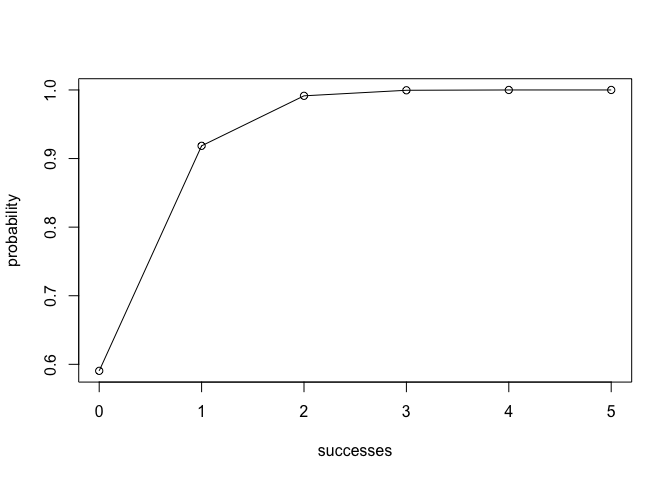

Binomial Package
================
Stella Cui
2019/5/2

**Binomial Package** \* Author Name: Stella Cui

Overview
--------

`"binomial"` is a minimal [R](http://www.r-project.org/) package that calculates the relative probability of the certain number of successes in the given total number of trials.

-   `bin_mean()` for the mean of your desired binomial distribution.
-   `bin_variance` for the variance of your desired binomial distribution.
-   `bin_mode` for the mode of your desired binomial distribution.
-   `bin_skewness` for the skeweneww of your desired binomial distribution.
-   `bin_kurtosis` for the mean of your desired binomial distribution.

Motivation
----------

This package has been developed to illustrate some of the usage of Binomial Package.

Installation
------------

Install the development version from GitHub via the package `"devtools"`:

``` r
# development version from GitHub:
#install.packages("devtools") 
# install "cointoss" (without vignettes)
devtools::install_github("stellacui1011/binomial")
# install "cointoss" (with vignettes)
devtools::install_github("stellacui1011/binomial", build_vignettes = TRUE)
```

Usage
-----

-   First, loading the package using library(Binomial)
-   Second, choosing the function you want to test
-   Third, choosing your input, such as the number of trails, that of successes, and probability
-   Fourth, get the output from your inputs and functions

``` r
#The followings are various examples of using my Binomial package
bin_choose(n=10,k=1)
#> [1] 10
bin_probability(1,10,0.1)
#> [1] 0.3874205
bin_cum <- bin_cumulative(5,0.1)
plot(bin_cum)
```



``` r
bin_mean(2,0.1)
#> [1] 0.2
bin_variance(2,0.1)
#> [1] 0.18
bin_mode(10,0.1)
#> [1] 1
bin_skewness(10,0.1)
#> [1] 0.843274
```

**trials = n, successes = k, and probability = prob or p**
